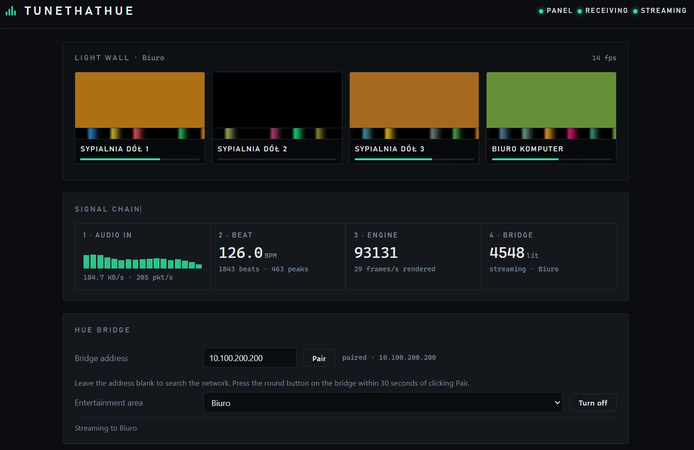
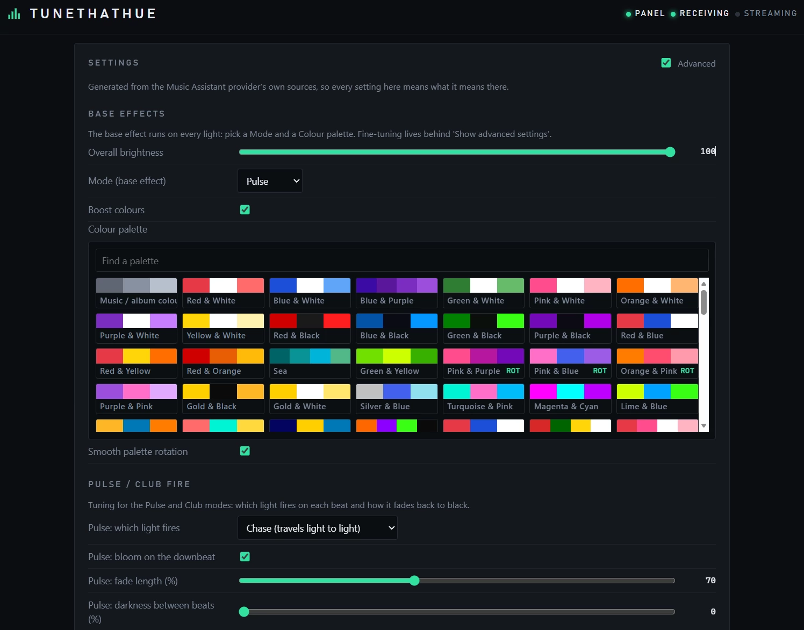
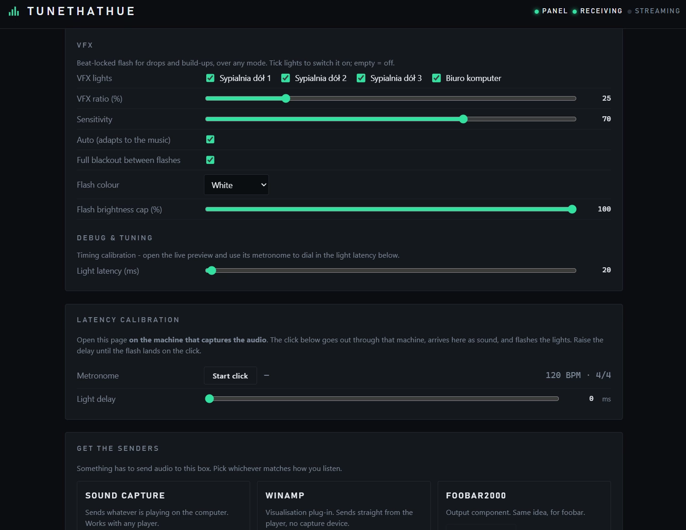

# TuneThatHue

**A DJ-style VFX daemon for Philips Hue, running on a QNAP NAS.**

Play music anywhere in the house. The NAS listens, finds the beat, and drives your Hue
lights like a small lighting desk — strobe on the drop, lights joining one by one
through a build-up, colour changing with the music.

No subscriptions. No cloud. Nothing extra to switch on. You need smart Hue bulbs, the
file server you already own, and fire.

**[Download from forum.qnap.net.pl](https://forum.qnap.net.pl/download/tunethathue.1113/)**

## What it does

- **Beat and tempo tracking.** Reads the tempo from the audio and keeps a beat grid, so
  every effect lands on the beat instead of near it.
- **Bars and phrases.** Counts bars and follows the phrasing, so effects change where
  the music changes, not on a timer.
- **Build-up detection.** When the track is rising into a drop, lights are recruited one
  at a time; on the drop, everything fires together.
- **Strobe (VFX).** Beat-locked flashing with its own rate, duty, colour, brightness cap
  and blackout between flashes. Pick which lights take part, by name.
- **155 colour palettes**, or colours taken from the music itself, with optional rotation
  every N beats.
- **Live light wall.** The panel shows the exact frames sent to the bridge, with a
  two-second trail under each light — you can see the rhythm, not just the result.
- **Sendspin emulation.** The daemon speaks the same protocol Music Assistant uses to
  feed a visualiser, so the effects engine runs unchanged outside Music Assistant.
- **Senders for Windows:** a Winamp plug-in, a foobar2000 component, and Sound Capture,
  which sends whatever is playing on the computer — any player, browser or game.

## Requirements

| What | Needed |
| --- | --- |
| **NAS** | QNAP, any platform (x86_64, ARM) |
| **Firmware** | **QuTS hero 6.0** or **QTS 6.0** |
| **Lights** | A Hue bridge with an Entertainment area |
| **Audio** | One of the Windows senders below, or anything that speaks the same protocol |

## Install

1. Download the `.qpkg` — from
   [forum.qnap.net.pl](https://forum.qnap.net.pl/download/tunethathue.1113/) or
   [Releases](../../releases) — and install it in App Center (*Install Manually*).
2. Open **TuneThatHue** from the QNAP main menu.
3. Type the bridge address, press **Pair**, then press the round button on the bridge.
4. Pick the Entertainment area and press **Turn on**.
5. Install a sender on the computer that plays the music and point it at the NAS.

## The senders

- **Sound Capture** — a tray app that sends whatever is playing. Works with any player.
  It can also capture one chosen application, a second sound card, or Stereo Mix.
- **Winamp plug-in** — sends straight from Winamp, no capture device needed.
- **foobar2000 component** — the same, for foobar2000 2.x.

All three send the same thing: a small stream of audio to the NAS on UDP port 6980.

## About the effects

The effects engine is the one from **Music Assistant**'s `hue_entertainment` provider,
copied in **byte for byte** — not rewritten, not adapted. TuneThatHue is a faithful
extension of that work: it adds what a standalone box needs (beat tracking, a panel,
pairing, packaging) and leaves the effects themselves untouched, so an effect tuned here
behaves the same in Music Assistant, and the other way round.

The settings screen is generated from the provider's own source files, so a setting means
the same thing on both sides.

That makes TuneThatHue useful the other way round too: **it is a workbench for building
and debugging VFX effects for
[Music Assistant](https://github.com/music-assistant/server).** Restarting the daemon
takes a second and the lights are in the room, so you can tune an effect here, watch the
frames on the light wall, and copy the file straight back into the provider.

## Timing

Light travels faster than sound. Open the panel **on the machine that captures the
audio**, start the metronome, and raise the light delay until the flash lands on the
click.

## Building it yourself

- `.qpkg`: see [`qnap/README-BUILD.md`](qnap/README-BUILD.md).
- Windows senders: `build-windows.ps1` (MSVC + Inno Setup).
- The Python daemon runs on any Linux box, including a Raspberry Pi:
  `python3 python/tth_phase2.py --pair --host <bridge-ip>`, then `--output hue`.

## Credits and licence

Apache-2.0. See [`NOTICE`](NOTICE) and [`THIRD-PARTY-NOTICES.md`](THIRD-PARTY-NOTICES.md).

Uses the Philips Hue Entertainment API. Not affiliated with, endorsed by, or sponsored by
Signify / Philips Hue, Winamp, or foobar2000.

---

TuneThatHue © 2025–2026 Silas Mariusz Grzybacz · [devspark.pl](https://devspark.pl)
published: [forum.qnap.net.pl](https://forum.qnap.net.pl/download/tunethathue.1113/) ·
qnap app repo: [myqnap.org](https://www.myqnap.org)
