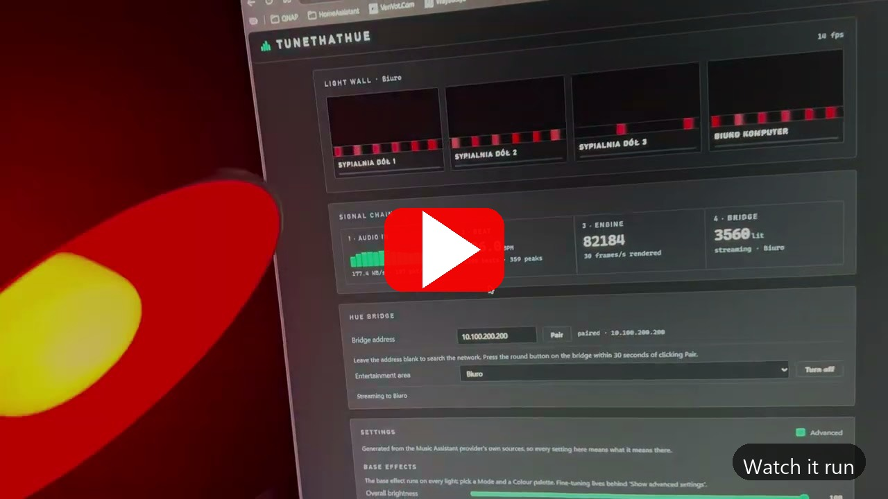
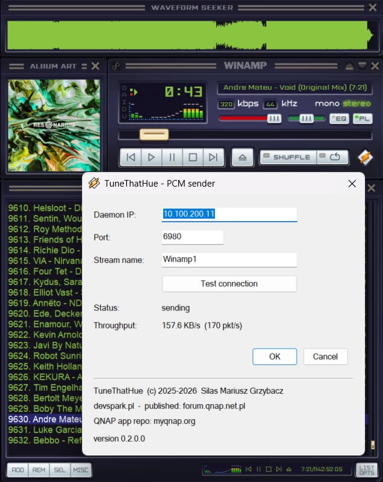

# TuneThatHue

**A DJ-style VFX daemon for Philips Hue.** Runs on a QNAP NAS, a PC, a Mac or a Pi.

Play music anywhere in the house. The box listens, finds the beat, and drives your Hue
lights like a small lighting desk: strobe on the drop, lights joining one by one through
a build-up, colour moving with the music.

No subscriptions. No cloud. Nothing extra to switch on. You need smart Hue bulbs, a
machine you already own, and fire.

**[Download from forum.qnap.net.pl](https://forum.qnap.net.pl/download/tunethathue.1113/)**

[](https://www.youtube.com/watch?v=w_EbUPbOirw)


## What it does

- Reads the tempo and keeps a beat grid, so effects land on the beat, not near it
- Counts bars and follows the phrasing
- Detects a build-up: lights join one at a time, then all fire on the drop
- Beat-locked strobe with its own rate, duty, colour and blackout
- 155 colour palettes, or colours taken from the music itself
- A live light wall showing the exact frames sent to the bridge

## How the music gets in

Five ways. Turn on as many as you like: one drives the lights at a time, and another
takes over a couple of seconds after it goes quiet.

| | How it finds you | What it needs |
| --- | --- | --- |
| **Sender** | You point it at the box | A Winamp, foobar2000 or AIMP plug-in, or Sound Capture |
| **Sendspin** | Music Assistant discovers the box | Nothing. It appears as a player |
| **Snapcast** | You give it the server address | A snapserver on the network |
| **Squeezebox** | The box finds the server by broadcast | Any Logitech Media Server or Music Assistant |
| **DLNA** | Anything looking for a speaker finds it | A phone, a hi-fi app, Music Assistant |

### What each one can play

The decoder ships inside the package, so this is what works out of the box with no
settings to change.

| Codec | Sender | Sendspin | Snapcast | Squeezebox | DLNA |
| --- | :-: | :-: | :-: | :-: | :-: |
| PCM / WAV | yes | — | yes | yes | yes |
| FLAC | — | — | yes | yes | yes |
| MP3 | — | — | — | yes | yes |
| AAC (ADTS) | — | — | — | yes | yes |
| AAC / ALAC in MP4 | — | — | — | no | yes |
| Ogg Vorbis | — | — | yes | yes | yes |
| Opus | — | — | no | yes | yes |
| WMA | — | — | — | yes | yes |
| AC3 | — | — | — | yes | yes |

Sendspin has no column because it sends no audio: Music Assistant analyses the sound and
sends the box the result. A dash means the protocol never carries that format.

### The two limits, and why

**MP4 over Squeezebox: no.** An MP4 keeps its index at the end of the file, so it cannot
be read from a one-way stream by anything. Over DLNA it works, because there the box
fetches the URL itself and can seek.

**Opus over Snapcast: no.** Snapcast sends raw Opus packets with no container. Its FLAC
chunks join into a valid FLAC stream and its Ogg chunks carry their own pages, but raw
Opus would have to be re-framed first. Use flac, ogg or pcm.

Both are reported in the panel in those words, so nobody has to guess.

## Where it runs

| | |
| --- | --- |
| **QNAP NAS** | QuTS hero 6.0 or QTS 6.0, any platform |
| **Windows** | 10 or 11, installs as a service with a tray icon |
| **macOS** | 12 or newer, launchd agent with a menu-bar icon |
| **Linux** | Ubuntu 24.04, Debian, Raspberry Pi OS: systemd user service |
| **Lights** | A Hue bridge with an Entertainment area |

## Install

Everything is on the [releases page](https://github.com/silasmariusz/TuneThatHue/releases).

| You have | Download | Then |
| --- | --- | --- |
| QNAP NAS | `TuneThatHue_x.y.z.qpkg` | App Center -> *Install Manually* |
| Windows 10/11 | `TuneThatHue-daemon-x.y.z-setup.exe` | run it |
| Linux, Raspberry Pi | `TuneThatHue-x.y.z-unix.tar.gz` | unpack, run `install/linux/install.sh` |
| macOS 12+ | `TuneThatHue-x.y.z-unix.tar.gz` | unpack, run `install/macos/install.sh` |
| Docker | `docker pull silasmariusz/tunethathue` | see below |

On every platform it installs as a service that starts by itself and keeps running: a
Windows service, a launchd agent, a systemd user unit, a QNAP package with a watchdog.
The panel is then on **`http://127.0.0.1:8080`** (`http://<nas>/TuneThatHue/` on a NAS),
and `tunethathue status` works from a terminal.


### Raspberry Pi and Linux, step by step

Tested on Ubuntu 24.04 and Raspberry Pi OS (64-bit) on a Pi 4B.

```sh
tar xzf TuneThatHue-0.9.0-unix.tar.gz
cd TuneThatHue-0.9.0
./install/linux/install.sh
```

That is the whole thing. No `sudo` except for two packages the tray icon needs, and
nothing is written outside your own account. It will:

1. **Find a Python 3.14**, and fetch a portable one if the system has none. Raspberry Pi
   OS and Ubuntu 24.04 both ship an older Python, so this normally downloads one - about
   30 MB, into the install directory, touching nothing system-wide. It has to be 3.14:
   the effects engine is carried byte-for-byte from Music Assistant and uses syntax
   older versions cannot parse.
2. **Make a virtual environment** and install what the daemon imports.
3. **Find a decoder.** It uses the bundled `ffmpeg` if the archive has one for your
   architecture, otherwise the system's. If you have neither, `sudo apt install ffmpeg`
   first - without it only uncompressed audio plays, which rules out most of what a
   Snapcast or DLNA sender will send you.
4. **Install a systemd user service** and enable lingering, so it starts at boot and
   keeps running after you log out.
5. **Install a tray icon** unless you pass `--no-tray`.

Afterwards:

```sh
tunethathue status          # is it running, and what is it hearing
tunethathue stop | start | restart
tunethathue panel           # open the browser panel
tunethathue codecs          # check every decoder the inputs need
journalctl --user -u tunethathue -f          # the log
./install/linux/install.sh --remove          # take it off again
```

**A headless Pi** needs nothing else - the panel is on `http://<pi>:8080` from any
machine on the network. Pass `--no-tray` and skip the two desktop packages.

**32-bit Raspberry Pi OS: the tempo will not lock.** NumPy publishes no build for 32-bit
ARM on Python 3.14, and the beat tracker needs it. Everything else works - the panel, the
inputs, pairing, colour - but the lights will not follow the beat. Use the 64-bit image
(`uname -m` should say `aarch64`), or run the container instead.

### Docker

```sh
docker run -d --name tunethathue --network host \
  -v tunethathue:/config silasmariusz/tunethathue:latest
```

**`--network host` is required. Bridge mode does not work**, and it fails in the way most
likely to waste an evening: the container starts, the panel opens, and then nothing ever
finds it — which reads as a broken program rather than a network setting. Three of the
four inputs are discovered by multicast or broadcast (mDNS for Sendspin, SSDP for DLNA, a
UDP broadcast for Squeezebox) and none of that crosses a Docker bridge. Publishing ports
does not help, because the discovery never reaches the container to begin with. Start it
on a bridge anyway and it says so in its own log.

If you want it isolated with an address of its own, use a `macvlan` network — that puts it
on the LAN properly, so multicast works:

```sh
docker network create -d macvlan --subnet=192.168.1.0/24 \
  --gateway=192.168.1.1 -o parent=eth0 lan
docker run -d --name tunethathue --network lan --ip 192.168.1.50 \
  -v tunethathue:/config silasmariusz/tunethathue:latest
```

`amd64` and `arm64` only, for the NumPy reason above.

## The senders



- **Sound Capture** — sends whatever is playing on the computer. Any player. Can also
  capture one chosen app, a second sound card, or Stereo Mix
- **Winamp** — a DSP plug-in, straight from the player
- **foobar2000** — the same, for foobar 2.x
- **AIMP** — loads the Winamp plug-in: copy `dsp_tunethathue.dll` into AIMP's `Plugins`
  folder. 32-bit AIMP only; on 64-bit use Sound Capture

All of them send the same thing to the box on UDP 6980.

## About the effects

The effects engine is the one from **Music Assistant**'s `hue_entertainment` provider,
copied in byte for byte. TuneThatHue adds what a standalone box needs (beat tracking, a
panel, pairing, packaging) and leaves the effects alone, so an effect tuned here behaves
the same in Music Assistant and the other way round.

That makes it useful in both directions: **it is a workbench for building and debugging
VFX effects for [Music Assistant](https://github.com/music-assistant/server)**. Restart
takes a second, the lights are in the room, and the file copies straight back.


## Timing

Light travels faster than sound. Open the panel **on the machine that captures the
audio**, start the metronome, and raise the light delay until the flash lands on the
click.

## Building it yourself

- `.qpkg`: [`qnap/README-BUILD.md`](qnap/README-BUILD.md)
- The bundled decoder: [`qnap/build_ffmpeg.sh`](qnap/build_ffmpeg.sh)
- Windows senders and daemon installer: `build-windows.ps1`,
  `installers/prepare-windows.ps1`

## Credits and licence

Apache-2.0. See [`NOTICE`](NOTICE) and
[`THIRD-PARTY-NOTICES.md`](THIRD-PARTY-NOTICES.md). The package carries an LGPL build of
FFmpeg for decoding.

Uses the Philips Hue Entertainment API. Not affiliated with, endorsed by, or sponsored
by Signify / Philips Hue, Native Instruments, Winamp, foobar2000 or AIMP.

---

TuneThatHue © 2025–2026 Silas Mariusz Grzybacz · [devspark.pl](https://devspark.pl)
published: [forum.qnap.net.pl](https://forum.qnap.net.pl/download/tunethathue.1113/) ·
qnap app repo: [myqnap.org](https://www.myqnap.org)
